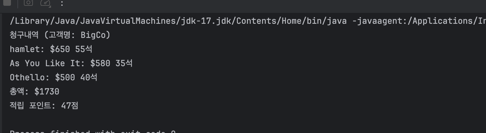

# CH01 리팩터링: 첫번째 예시

1. 리팩토링의 출발점은 기존 로직을 검증할 수 있는 테스트 코드를 먼저 만드는 거다. 그리고 매번 리팩토링 단계를 거칠 때마다, 테스트를 돌려서 코드가 망가지지 않았는지 확인한다.

2. 리팩토링을 제대로 해내는 핵심은 단계를 쪼개는 데에 있다. 작게 나눈 단계일수록 더 빠르게 진행할 수 있고, 코드를 망가뜨리지 않으며, 그런 작은 변화들이 쌓여서 꽤 큰 개선으로 이어진다는 걸 직접 체감하게 된다.

3. 좋은 코드인지 아닌지를 판단할 수 있는 가장 확실한 기준은 수정이 얼마나 쉬운가다. 코드는 명확해야 한다. 수정이 필요한 상황에서, 손봐야 할 부분을 빠르게 찾아내고 실수 없이 고칠 수 있어야 한다.

이런 식으로 잘 정돈된 코드베이스는 팀의 생산성을 극대화하고, 고객이 원하는 기능을 더 빠르고, 더 적은 비용으로 제공할 수 있게 만들어준다.

---


첫번째 예제 코드 결과이다. 

## 기능 추가가 어려운 구조의 문제점

기능은 돌아가지만, 막상 뭔가 더하려고 하면 손대기 겁나는 코드다.

왜냐면 설계가 엉켜 있는 시스템은, 어디를 고쳐야 할지 찾기도 힘들고, 수정한 부분이 다른 코드랑 잘 맞물리게 만드는 것도 어렵기 때문이다.

이럴 땐 기능부터 덧붙이기보다, 구조부터 손보는 게 훨씬 낫다. 구조를 잘 다듬으면, 기능 추가는 자연스럽게 따라온다.

예를 들어, 청구 내역을 HTML 형식으로도 출력해야 한다고 해보자.  

statement() 함수에 이건 텍스트로 출력, 이건 HTML로 출력 같은 조건문을 추가하게 될것이다. 
👉🏻 그러면 함수가 점점 복잡해진다.  

어떨 땐 아예 statement()를 복사해서 htmlStatement()라는 새 함수를 만들기도 한다.  
이러면 **중복**이 생기고, 코드가 변경될 때마다 두 곳을 다 고쳐야 해서 관리가 어려워진다. **DRY 원칙** 위반이다.

또 하나.  
앞으로 극단이 더 다양한 장르의 연극을 하게 될 수도 있다. 장르가 늘어나면 당연히 가격 책정 로직과 포인트 계산도 바뀔 거다.

그런데 지금 구조에서는 새로운 장르를 추가하려면 switch 문에 조건을 더 늘려야 하고, 이곳저곳 고쳐야 할 게 많다.  
이럴 땐 구조를 먼저 유연하게 바꿔야 한다. 그래야 나중에 새로운 기능을 더할 때도 덜 아프다!

---

## 리팩토링의 첫 단계

리팩토링을 시작할 땐 항상 같은 자리에서 출발해야 한다.  
**리팩토링 대상 코드가 제대로 동작하는지 확인할 수 있는 테스트 코드부터 만드는 것.**

리팩토링 과정에서는 실수를 최대한 줄이는 다양한 기법들을 쓰지만, 결국 그 기법들을 실행하는 건 사람이기 때문에 실수는 언제든 발생할 수 있다.  
그래서 테스트는 일종의 안전망 역할을 한다.

테스트가 있으면, 코드를 바꾼 후에도 결과가 여전히 잘 나오는지 바로 확인할 수 있다.

---

## 함수 쪼개기: 긴 함수에서 역할 분리하기

statement()처럼 덩치가 큰 함수는 먼저 전체 흐름 속에서 **쪼갤 수 있는 부분**을 찾는 게 중요하다.  
예를 들어 중간에 있는 `switch` 문부터 시작해보자.

```java
switch (play.getType()) {
    case TRAGEDY:
        thisAmount = 40000;
        if (performance.getAudience() > 30) {
            thisAmount += 1000 * (performance.getAudience() - 30);
        }
        break;
    case COMEDY:
        thisAmount = 30000;
        if (performance.getAudience() > 20) {
            thisAmount += 10000 + 500 * (performance.getAudience() - 20);
        }
        thisAmount += 300 * performance.getAudience();
        break;
    default:
        throw new Exception("알 수 없는 장르");
}
```

- 이 코드는 '공연 하나에 대한 요금을 계산'하는 역할을 한다.  
이런 핵심 역할은 별도의 함수로 추출하는 게 좋다.  
- 코드에 반영해 이름만 봐도 역할이 드러나도록 하자.

예: `amountFor(performance)`

---

### 추출된 함수

```java
private int amountFor(Performance performance, Play play) throws Exception {
    int thisAmount;
    switch (play.getType()) {
        case TRAGEDY:
            thisAmount = 40000;
            if (performance.getAudience() > 30) {
                thisAmount += 1000 * (performance.getAudience() - 30);
            }
            break;
        case COMEDY:
            thisAmount = 30000;
            if (performance.getAudience() > 20) {
                thisAmount += 10000 + 500 * (performance.getAudience() - 20);
            }
            thisAmount += 300 * performance.getAudience();
            break;
        default:
            throw new Exception("알 수 없는 장르");
    }
    return thisAmount;
}
```

---

### 바뀐 statement() 함수

```java
public String statement(Invoice invoice, Plays plays) throws Exception {
    int totalAmount = 0;
    int volumeCredit = 0;
    StringBuilder result = new StringBuilder(String.format("청구내역 (고객명: %s)\n", invoice.getCustomer()));
    
    for (Performance performance : invoice.getPerformances()) {
        Play play = plays.get(performance);

        int thisAmount = amountFor(performance, play);

        // 포인트를 적립한다.
        volumeCredit += Math.max(performance.getAudience() - 30, 0);

        // 희극 관객 5명마다 추가 포인트를 제공한다.
        if (play.getType().equals(PlayType.COMEDY)) {
            volumeCredit += Math.floor(performance.getAudience() / 5);
        }

        // 청구 내역을 출력한다.
        result.append(String.format("%s: $%d %d석\n", play.getName(), thisAmount / 100, performance.getAudience()));
        totalAmount += thisAmount;
    }

    result.append(String.format("총액: $%d\n", totalAmount / 100));
    result.append(String.format("적립 포인트: %d점", volumeCredit));
    return result.toString();
}
```

아무리 단순한 수정이라도 리팩토링 후엔 꼭 테스트를 돌려보자.  
작은 단위로 나눠서 리팩토링하면, 문제가 생겨도 어디서 생겼는지 바로 찾을 수 있다.  
반대로 한 번에 너무 많이 바꾸면 디버깅에 시간만 잡아먹힌다.

---

### ⭐️함수 추출 팁
대부분의 IDE는 함수 추출 기능을 제공한다.  
단축키를 외워두면 큰 도움이 된다.  
(IntelliJ, macOS 기준: `Command + Option + M`)

함수를 추출한 뒤에는 **변수 이름이나 표현 방식도 더 명확하게 정리**해보자.  
예를 들어 `thisAmount`는 `result`처럼 더 직관적인 이름으로 바꾸는 것도 좋다.

---

## 변수명 변경하기: 이름만으로 의도를 드러내자

함수를 잘게 나눴다면, 그 다음 할 일은 **변수 이름을 명확하게 바꾸는 것**이다.  
특히 반환값에는 일관되게 `result`라는 이름을 쓰면 좋다.  
이름만 보고도 역할을 짐작할 수 있게 만드는 게 핵심이다.

그리고 지금처럼 자바가 아닌 동적 타입 언어(JavaScript 등)라면 매개변수 이름에 `aPerformance`처럼 **부정 관사**를 붙여서 타입을 암시하기도 한다.  
자바는 정적 타입 언어라 굳이 그렇게까지는 하지 않아도 괜찮지만, **매개변수의 역할이 모호할 때는 이런 작명 전략이 유용하다.**

그렇다면 이름을 굳이 바꿀 필요가 있을까?  
**당연하다.** 좋은 코드란, **이름만 봐도 어떤 일을 하는지 보이는 코드**다.  
그리고 이걸 결정짓는 게 바로 변수명이다.

---

### 예: 리팩토링 전

```java
int thisAmount = amountFor(performance, play);
```

---

### 예: 리팩토링 후

```java
int result = amountFor(performance, play);
```

- 반환값은 `thisAmount`보다 `result`가 더 직관적이다.
- 함수 내부에서도 `thisAmount`라는 이름을 `result`로 통일해주는 것이 좋다.

```java
private int amountFor(Performance performance, Play play) throws Exception {
    int result;
    switch (play.getType()) {
        case TRAGEDY:
            result = 40000;
            if (performance.getAudience() > 30) {
                result += 1000 * (performance.getAudience() - 30);
            }
            break;
        case COMEDY:
            result = 30000;
            if (performance.getAudience() > 20) {
                result += 10000 + 500 * (performance.getAudience() - 20);
            }
            result += 300 * performance.getAudience();
            break;
        default:
            throw new Exception("알 수 없는 장르");
    }
    return result;
}
```

---

### 참고: play 매개변수는?

`performance`나 `play` 중에서 `play`는 공연 자체가 아니라 **해당 공연의 극 정보**를 의미하므로  
**`playInfo`**, **`selectedPlay`**, **`show`** 같이 조금 더 역할이 드러나는 이름으로 바꿔볼 수도 있다.  

이처럼 작은 이름 변경 하나도 코드 이해도에 큰 영향을 줄 수 있다.  
그래서 리팩토링의 마지막 단계에서는 꼭 **이름을 다시 살펴보자.**

---

## 불필요한 변수 제거하기: 질의 함수로 교체

`amountFor()` 함수에서 사용되던 `play` 변수는 사실상 `performance`로부터 구할 수 있는 값이다.  
따라서 별도의 임시 변수로 둘 필요 없이, 계산에 필요한 값을 **질의 함수로 추출**하는 방식으로 리팩토링할 수 있다.

이렇게 하면 함수 안의 변수 수가 줄어들고, **함수 추출하기 작업이 훨씬 수월**해진다.

### playFor 함수 추가

```java
private Play playFor(Plays plays, Performance performance) {
    return plays.get(performance);
}
```

---

## statement() 함수 개선 (1차 리팩토링)

기존의 `play` 임시 변수 제거 → `playFor()` 함수 사용

```java
public String statement(Invoice invoice, Plays plays) throws Exception {
    int totalAmount = 0;
    int volumeCredit = 0;
    StringBuilder result = new StringBuilder(String.format("청구내역 (고객명: %s)\n", invoice.getCustomer()));
    
    for (Performance performance : invoice.getPerformances()) {
        int thisAmount = amountFor(performance, plays);

        volumeCredit += Math.max(performance.getAudience() - 30, 0);

        if (playFor(plays, performance).getType().equals(PlayType.COMEDY)) {
            volumeCredit += Math.floor(performance.getAudience() / 5);
        }

        result.append(String.format("%s: $%d %d석\n", playFor(plays, performance).getName(), thisAmount / 100, performance.getAudience()));
        totalAmount += thisAmount;
    }

    result.append(String.format("총액: $%d\n", totalAmount / 100));
    result.append(String.format("적립 포인트: %d점", volumeCredit));
    return result.toString();
}
```

---

## amountFor 함수에서도 play 제거

```java
private int amountFor(Performance performance, Plays plays) throws Exception {
    int result;
    switch (playFor(plays, performance).getType()) {
        case TRAGEDY:
            result = 40000;
            if (performance.getAudience() > 30) {
                result += 1000 * (performance.getAudience() - 30);
            }
            break;
        case COMEDY:
            result = 30000;
            if (performance.getAudience() > 20) {
                result += 10000 + 500 * (performance.getAudience() - 20);
            }
            result += 300 * performance.getAudience();
            break;
        default:
            throw new Exception("알 수 없는 장르");
    }
    return result;
}
```

---

## 변수 인라인하기 적용

`thisAmount` 변수를 바로 `amountFor()` 호출로 대체 → 코드 간결화

---

## volumeCredit 로직도 함수로 추출

```java
private int volumeCreditFor(Plays plays, Performance performance) {
    int result = 0;
    result += Math.max(performance.getAudience() - 30, 0);
    if (playFor(plays, performance).getType().equals(PlayType.COMEDY)) {
        result += Math.floor(performance.getAudience() / 5);
    }
    return result;
}
```

---

## 반복문 쪼개기 → 변수 추출 준비

```java
public String statement(Invoice invoice, Plays plays) throws Exception {
    int totalAmount = 0;
    int volumeCredit = 0;

    StringBuilder result = new StringBuilder(String.format("청구내역 (고객명: %s)\n", invoice.getCustomer()));

    for (Performance performance : invoice.getPerformances()) {
        result.append(String.format("%s: $%d %d석\n", playFor(plays, performance).getName(), amountFor(performance, plays) / 100, performance.getAudience()));
        totalAmount += amountFor(performance, plays);
    }

    for (Performance performance : invoice.getPerformances()) {
        volumeCredit += volumeCreditFor(plays, performance);
    }

    result.append(String.format("총액: $%d\n", totalAmount / 100));
    result.append(String.format("적립 포인트: %d점", volumeCredit));
    return result.toString();
}
```

---

## 변수 → 질의 함수로 변경

```java
private int totalVolumeCredits(Invoice invoice, Plays plays) {
    int volumeCredit = 0;
    for (Performance performance : invoice.getPerformances()) {
        volumeCredit += volumeCreditFor(plays, performance);
    }
    return volumeCredit;
}
```

이제 `volumeCredit` 변수는 더 이상 필요 없다. → `statement()`에서 직접 함수 호출

---

## 리팩토링 후 statement() 메소드

```java
public String statement(Invoice invoice, Plays plays) throws Exception {
    int totalAmount = 0;
    StringBuilder result = new StringBuilder(String.format("청구내역 (고객명: %s)\n", invoice.getCustomer()));

    for (Performance performance : invoice.getPerformances()) {
        result.append(String.format("%s: $%d %d석\n", playFor(plays, performance).getName(), amountFor(performance, plays) / 100, performance.getAudience()));
        totalAmount += amountFor(performance, plays);
    }

    result.append(String.format("총액: $%d\n", totalAmount / 100));
    result.append(String.format("적립 포인트: %d점", totalVolumeCredits(invoice, plays)));
    return result.toString();
}
```

---

**성능 걱정은 잠시 접어두자**

반복문을 나누면 성능이 떨어지지 않을까?  
→ 성능 차이는 거의 없다. 리팩토링이 먼저다.  

최적화는 나중 문제고, **구조가 명확한 코드일수록 성능 개선도 쉬워진다.**

---

## totalAmount()도 질의 함수로 정리

```java
private int totalAmount(Invoice invoice, Plays plays) throws Exception {
    int totalAmount = 0;
    for (Performance performance : invoice.getPerformances()) {
        totalAmount += amountFor(performance, plays);
    }
    return totalAmount / 100;
}
```

---

## 리팩토링 후 Statement 클래스

- `statement()`는 단 7줄.
- 계산 로직은 모두 질의 함수로 추출.
- 각 책임이 명확하게 분리됨.

---

## 계산 단계와 포맷팅 단계 분리하기

지금까지는 프로그램의 논리적인 구조를 파악하기 쉽도록, 복잡하게 얽힌 로직을 분리하고 이름을 붙여주는 리팩토링을 해왔다. 이는 리팩토링 초기 단계에서 매우 중요하다. 골격이 충분히 개선되었으니, 이제 진짜 목적이었던 `statement()`의 HTML 버전을 만들어보자.

코드를 처음 봤을 때보다 훨씬 작업하기 쉬워졌다는 걸 느낄 수 있다. 왜냐하면 계산 로직이 모두 따로 빠져나가 있어서, 이제는 출력 형식에 맞춰 결과만 바꾸면 되기 때문이다.

가장 좋은 방식은 **계산 단계와 포맷팅 단계를 분리**하는 것이다. 계산 결과를 중간 데이터 구조에 담고, 이 데이터를 기반으로 텍스트 또는 HTML로 출력하게 만들면 된다.

### 1단계: 텍스트 출력 로직 추출

```java
private String renderPlainText(Invoice invoice, Plays plays) throws Exception {
    ...
}
```

→ `statement()`에서는 이 함수만 호출하도록 변경

```java
public String statement(Invoice invoice, Plays plays) throws Exception {
    return renderPlainText(invoice, plays);
}
```

### 2단계: 중간 데이터 구조 만들기

출력에 필요한 데이터를 담을 `StatementData` 클래스를 만들고, `statement()`에서 이를 생성해 `renderPlainText()`에 넘긴다.

```java
StatementData statementData = new StatementData(invoice, plays);
```

출력에 필요한 필드들을 하나씩 `StatementData`로 옮긴다. 먼저 고객명, 그 다음 공연 목록, 그리고 `playFor()`, `amountFor()` 등 계산 함수들을 이 클래스로 이동시킨다.

### 3단계: renderPlainText 재작성

모든 로직이 `StatementData`를 통해 접근되도록 변경한다. 최종적으로 `statement()`는 다음처럼 된다:

```java
public String statement(Invoice invoice, Plays plays) throws Exception {
    StatementData statementData = new StatementData(invoice, plays);
    return renderPlainText(statementData);
}
```

그리고 HTML 버전도 손쉽게 추가할 수 있다:

```java
private String renderHtml(StatementData statementData) throws Exception {
    ...
}
```

계산 코드의 중복 없이 HTML과 텍스트 버전을 동시에 지원할 수 있게 되었다.

---

## 다형성을 활용해 계산 코드 재구성하기

지금까지는 조건문을 기반으로 연극 장르에 따른 공연료와 포인트를 계산했지만, 장르가 늘어날수록 이 조건문은 점점 복잡해지고 수정하기 어려워진다. 이런 문제를 해결하기 위해 **다형성**을 활용한 구조로 리팩토링해보자.

### 문제점: 조건문이 많아질수록 유지보수 어려움

```java
switch (play.getType()) {
    case TRAGEDY: ...
    case COMEDY: ...
}
```

→ 장르가 추가되면 `switch` 문이 길어지고, 관련된 여러 함수도 함께 고쳐야 한다.

---

### 해결 전략: 계산 로직을 클래스로 분리 + 다형성 적용

- 공연별로 공연료와 포인트를 계산하는 `PerformanceCalculator` 클래스를 만들고, 희극과 비극은 이를 상속하여 자신만의 계산 로직을 구현한다.
- 조건문은 **클래스로 대체**된다.

---

### 1단계: PerformanceCalculator 클래스 생성

```java
public class PerformanceCalculator {
    protected Performance performance;
    protected Play play;

    public PerformanceCalculator(Performance performance, Play play) {
        this.performance = performance;
        this.play = play;
    }

    public int amountFor() throws Exception {
        throw new Exception("서브 클래스에서 구현되어야 합니다.");
    }

    public int volumeCreditFor() {
        return Math.max(performance.getAudience() - 30, 0);
    }
}
```

---

### 2단계: 장르별 서브 클래스 생성

```java
public class TragedyCalculator extends PerformanceCalculator {
    public TragedyCalculator(Performance performance, Play play) {
        super(performance, play);
    }

    @Override
    public int amountFor() {
        int result = 40000;
        if (performance.getAudience() > 30) {
            result += 1000 * (performance.getAudience() - 30);
        }
        return result;
    }
}

public class ComedyCalculator extends PerformanceCalculator {
    public ComedyCalculator(Performance performance, Play play) {
        super(performance, play);
    }

    @Override
    public int amountFor() {
        int result = 30000;
        if (performance.getAudience() > 20) {
            result += 10000 + 500 * (performance.getAudience() - 20);
        }
        result += 300 * performance.getAudience();
        return result;
    }

    @Override
    public int volumeCreditFor() {
        int result = super.volumeCreditFor();
        result += Math.floor(performance.getAudience() / 5);
        return result;
    }
}
```

---

### 3단계: Factory로 다형성 인스턴스 생성

```java
public class PerformanceCalculatorFactory {
    public PerformanceCalculator createPerformanceCalculator(Performance performance, Play play) throws Exception {
        switch (play.getType()) {
            case TRAGEDY:
                return new TragedyCalculator(performance, play);
            case COMEDY:
                return new ComedyCalculator(performance, play);
            default:
                throw new Exception("알 수 없는 장르: " + play.getType());
        }
    }
}
```

---

### 4단계: StatementData 클래스에서 계산 위임

```java
public int amountFor(Performance performance) throws Exception {
    return performanceCalculatorFactory.createPerformanceCalculator(performance, playFor(performance)).amountFor();
}

private int volumeCreditFor(Performance performance) throws Exception {
    return performanceCalculatorFactory.createPerformanceCalculator(performance, playFor(performance)).volumeCreditFor();
}
```

---

### 정리

- 조건문 기반의 복잡한 계산 로직을 **클래스 기반의 구조로 분리**하여 가독성과 유지보수성을 높였다.
- **장르가 추가되어도 서브클래스만 추가하면 되므로 확장에 유리**하다.
- amount 계산, 포인트 계산이 모두 다형성 기반으로 처리된다.

이처럼 **공통 인터페이스를 공유하는 다형성 구조**를 활용하면,
기능 확장에 강한 구조를 만들 수 있다.

---
## 마치며: 리팩토링의 핵심은 ‘작고 안전한 변화’

이번 예시는 작지만, 리팩토링의 흐름과 사고방식을 익히기엔 충분한 예제였다.  
여기까지 오며 우리는 다음과 같은 대표적인 리팩토링 기법들을 경험했다:

- **함수 추출하기 (Extract Function)**  
- **변수 인라인하기 (Inline Variable)**  
- **함수 옮기기 (Move Function)**  
- **조건부 로직을 다형성으로 바꾸기 (Replace Conditional with Polymorphism)**  

---

### 리팩토링은 이렇게 진행됐다

1. **함수를 나누고 구조를 분리하는 것부터 시작**  
   → 원본 함수(statement)를 중첩된 여러 함수로 분해해서 흐름을 명확히 했다.

2. **단계 쪼개기(Split Phase)**를 적용해  
   → 계산과 출력의 역할을 나누고, HTML 출력 같은 새로운 기능도 쉽게 추가할 수 있도록 준비했다.

3. **조건문을 다형성으로 대체**해  
   → 각 장르에 따른 계산 로직을 별도 클래스로 분리하고, 구조적인 확장 가능성을 확보했다.

이러한 리팩토링 과정을 거치며 코드는 **더 명확하고, 변경에 유연하며, 유지보수하기 쉬운 구조**로 재탄생했다.

---

### 좋은 코드의 기준: ‘얼마나 수정하기 쉬운가’

- 어떤 코드가 **좋은 코드**인지에 대한 정의는 사람마다 다르다.  
- 하지만 **‘수정하기 쉬운 코드’**는 분명히 좋은 코드의 한 기준이 될 수 있다.

코드는 **명확**해야 하고, **변경이 필요한 상황에서 빠르고 정확하게 수정 가능**해야 한다.  
이런 코드베이스는 팀의 생산성을 끌어올리고, 고객에게 가치를 더 빠르고 효율적으로 전달할 수 있게 해준다.

---

### 가장 중요한 것은 ‘리팩토링의 리듬’

이 예시를 통해 진짜 배워야 할 점은 따로 있다.  
바로 **리팩토링을 작고 안전한 단계로 나누는 리듬**이다.

- 코드가 망가지지 않도록,  
- 매 단계마다 **컴파일 & 테스트**를 반복하며,  
- 한 번에 많은 걸 바꾸기보다 **조금씩 구조를 개선해나가는 방식**

> "큰 변화는 작고 안전한 리듬에서 비롯된다."
.
