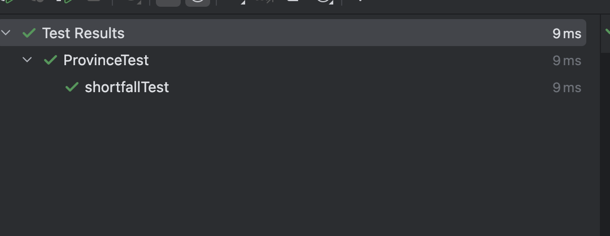
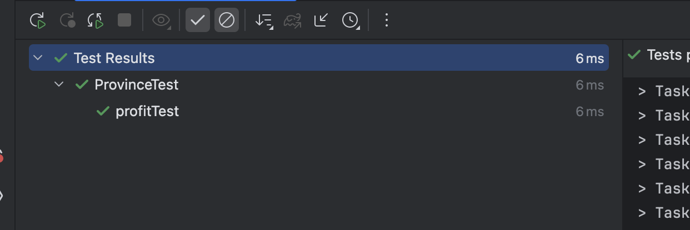
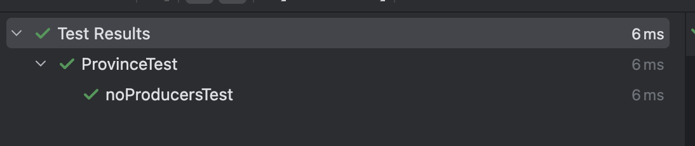

# 04. 테스트 구축하기

리팩토링은 소프트웨어 개발에서 필수적인 작업이지만, 이를 제대로 수행하려면 테스트 케이스가 반드시 필요하다.
테스트 케이스는 리팩토링 후에도 기능이 올바르게 동작하는지를 확인하는 역할을 한다.
설령 리팩토링을 하지 않더라도, 이런 테스트를 작성하는 것은 개발 효율을 크게 높여준다
테스트 작성에 시간을 투자하면 개발 속도가 느려질 것이라고 생각할 수 있지만 실제로는 그렇지 않음! 그 이유를 아래에서 자세히 살펴보자.

## 4.1 자가 테스트 코드의 가치

프로그래머가 시간을 보내는 비중을 분석해보면 실제 코드를 작성하는 시간은 생각보다 많지 않다.

현재 상황을 파악하거나 설계를 구상하는 데 시간을 사용하기도 하고,
특히 버그를 찾기 위한 디버깅에 많은 시간을 할애.

***테스트 코드는 이런 디버깅 시간을 줄이는 데 큰 도움을 줍니다.***
- **코드를 작성하면서 동시에 테스트 코드를 추가하면**, 테스트가 실패했을 때 최근에 작성한 코드에 문제가 있을 가능성이 높다. 
- 이는 찾아야 할 코드의 범위를 크게 줄여주므로 디버깅 시간을 획기적으로 단축한다. 
- 즉, 테스트 코드는 강력한 버그 검출 도구로 작용하여 버그를 찾는 시간을 줄여준다.

### 테스트 작성의 최적 타이밍

테스트를 작성하기 가장 좋은 시점은 기능을 추가하기 전, 즉 **실제 프로그래밍을 시작하기 전**에 작성하는 것입니다.

얼핏 순서가 뒤바뀐 것처럼 느껴질 수 있지만, 이는 매우 유익한 접근법.
테스트를 먼저 작성하면 원하는 기능이 무엇인지 고민하게 되고, 실제 구현보다는 인터페이스 설계에 집중할 수 있습니다.
또한, 테스트가 모두 통과되는 시점을 코딩 완료 시점으로 명확히 정의할 수 있다.
이러한 "테스트 먼저 작성" 습관 
👉🏻 **테스트 주도 개발(Test-Driven Development, TDD)** 
TDD는 다음 과정을 따른다:

1. 테스트를 먼저 작성
2. 테스트를 통과하도록 코드 작성
3. 코드 리팩토링

이번 장에서는 테스트 코드 작성 방법을 소개한다.
테스트 자체가 주제는 아니므로 깊이 들어가지는 않겠지만, 테스트가 어떤 효과를 가져오는지 확실히 정리해보겠다.. 

## 4.2 테스트할 샘플 코드

 지역(Province)과 생산자(Producer)로 구성된 비즈니스 로직을 다룬다.
👉🏻
 •	생산 부족분 계산
 •	총수익 계산
 → 추후 TODO

비즈니스 로직은 두 개의 주요 클래스인
**지역(Province)**과 **생산자(Producer)**로 구성되며,

각 클래스는 다음과 같은 역할을 한다:

- 지역(Province): 수요(demand)와 가격(price)을 관리하며, 생산 부족분(shortfall)과 총수익(profit)을 계산.
- 생산자(Producer): 제품을 특정 비용(cost)으로 특정 수량(production)만큼 생산.
- 사용자는 수요, 가격, 생산량, 비용 등을 조정하며 그에 따른 부족분과 수익을 확인할 수 있다.

>샘플 데이터
>- 지역: Asia
>- 수요: 30
>- 가격: 20
>- 생산자:
>     - Byzantium: 비용 10, 생산량 9, 수익 90
>     - Attalia: 비용 12, 생산량 10, 수익 120
>     - Sinope: 비용 10, 생산량 6, 수익 60
>- 부족분: 5
>- 총수익: 230

## 4.3 첫 번째 테스트

다음은 **생산 부족분(shortfall)** 을 테스트하는 코드. 

```java
 @Test
 void shortfallTest() {
  // given
  Province sampleProvince = SampleProvinceFactory.getSampleProvince();
  int answer = 5;
  // when
  int result = sampleProvince.shortFall();
  // then
  assertEquals(answer, result);
 }
} 
```



- given: 테스트에 필요한 객체와 데이터를 설정.
- when: 실제 코드를 실행.
- then: 결과를 검증.

## 4.4 테스트 추가하기

테스트를 추가할 때는 모든 public 메서드를 무조건 테스트하는 것이 아니라, 위험 요소를 기준으로 작성해야 한다.

- 테스트의 목적은 향후 버그를 방지하고 발견하는 것이므로, 위험한 부분에 집중해야 한다.
- 예를 들어, get()이나 set() 같은 단순 메서드는 테스트할 필요가 없다.

```java
  @Test
void profitTest(){
 //given
 Province sampleProvince = SampleProvinceFactory.getSampleProvince();
 int answer = 230;
 //when
 int result = sampleProvince.profit();
 //then
 assertEquals(answer, result);
}
```


**중복 제거**

위 테스트에서 Province sampleProvince = SampleProvinceFactory.getSampleProvince(); 
부분이 shortfallTest와 중복된다. 중복은 제거하는 것이 좋지만, 단순히 객체를 클래스 수준에서 공유하는 방식은 추천하지 않ㄴ,ㄴ다.

👉🏻이유: 한 테스트가 객체를 변경하면 다른 테스트에 영향을 줄 수 있기 때문!

대신, `@BeforeEach`를 사용해 각 테스트마다 새로운 객체를 생성하도록 수정해야한다.

위에서 말한 bad case

```java
class ProvinceTest {

    Province sampleProvince = SampleProvinceFactory.getSampleProvince();
    
    @Test
    void shortfallTest(){
        //given
        int answer = 5;
        //when
        int result = sampleProvince.shortFall();
        //then
        assertEquals(answer, result);
    }

    @Test
    void profitTest(){
        //given
        int answer = 230;
        //when
        int result = sampleProvince.profit();
        //then
        assertEquals(answer, result);
    }
}
```
`@BeforeEach`를 사용한 good case
```java
class ProvinceTest {

    Province sampleProvince;

    @BeforeEach
    void setUp() {
        sampleProvince = SampleProvinceFactory.getSampleProvince();
    }

    @Test
    void shortfallTest(){
        //given
        int answer = 5;
        //when
        int result = sampleProvince.shortFall();
        //then
        assertEquals(answer, result);
    }

    @Test
    void profitTest(){
        //given
        int answer = 230;
        //when
        int result = sampleProvince.profit();
        //then
        assertEquals(answer, result);
    }
}
```
정리하자면 공유 픽처스를 사용하면 안되고 **불변의 객체** 를 가지고 테스트를 진행해야 한다.

## 4.5 픽스처 수정하기
지금까지는 고정된 픽스처(샘플 데이터)를 사용했지만,
실제로는 Setter 메서드로 데이터가 변경될 수 있다.
특히 Producer 클래스의 setProduction() 메서드는 totalProduction을 업데이트하므로, 이를 테스트해야 한다.

```java
@Test
void changeProductionTest() {
// given
int shortFall = -6;
int profit = 292;
// when
sampleProvince.getProducers().get(0).setProduction(20);
int actualShortFall = sampleProvince.shortFall();
int actualProfit = sampleProvince.profit();
// then
assertEquals(shortFall, actualShortFall);
assertEquals(profit, actualProfit);
}
```


이 테스트는 두 개의 assertEquals()를 사용했지만, 일반적으로 한 테스트에는 하나의 검증만 두는 것이 좋다.
👉🏻이유: 첫 번째 검증이 실패하면 두 번째 검증이 실행되지 않아 유용한 정보를 놓칠 수 있기 때문!


## 4.6 경계 조건 검사하기
지금까지는 정상적인 데이터로 테스트를 진행했다. 하지만 경계 조건에서도 문제가 없는지 확인해야 한다.

예를 들어, 생산자가 없는 경우를 테스트해보겠다.

```java
@Test
void noProducersTest() {
// given
Province province = new Province("No Producers", new ArrayList<>(), 30, 20);
int shortFall = 30;
int profit = 0;
// when
int actualShortFall = province.shortFall();
int actualProfit = province.profit();
// then
assertEquals(shortFall, actualShortFall);
assertEquals(profit, actualProfit);
}
```


**일반적인 데이터의 경우에는 맞지않는 특이한 데이터를 넣어보자**

ex)
- 수요가 0인 경우: 수요는 음수가 될 수 없으므로 최소값 0을 테스트.

유효성 검사는 너무 많으면 중복 체크로 비효율적이 될 수 있지만, 
외부 시스템에서 받은 데이터(예: JSON)는 항상 검증하는 것이 좋다.

**테스트 범위 고민**
"테스트를 어느 정도까지 해야 할까?"라는 질문은 흔함.

테스트는 개발 속도를 높여주지만, 과도하게 집착하면 기능 추가 의욕이 떨어질 수 있다.
위험한 부분과 복잡한 로직을 우선적으로 테스트하자.

테스트 코드 full ver

```java
class ProvinceTest {

    Province sampleProvince;

    @BeforeEach
    void setUp() {
        sampleProvince = SampleProvinceFactory.getSampleProvince();
    }

    @Test
    void shortfallTest(){
        //given
        int answer = 5;
        //when
        int result = sampleProvince.shortFall();
        //then
        assertEquals(answer, result);
    }

    @Test
    void profitTest(){
        //given
        int answer = 230;
        //when
        int result = sampleProvince.profit();
        //then
        assertEquals(answer, result);
    }
    @Test
    void changeProductionTest() {
        // given
        int shortFall = -6;
        int profit = 292;
        // when
        sampleProvince.getProducers().get(0).setProduction(20);
        int actualShortFall = sampleProvince.shortFall();
        int actualProfit = sampleProvince.profit();
        // then
        assertEquals(shortFall, actualShortFall);
        assertEquals(profit, actualProfit);
    }

    @Test
    void noProducersTest(){
        //given
        Province province = new Province("No Producers", new ArrayList<>(), 30, 20);
        int shortFall = 30;
        int profit = 0;
        //when
        int actualShortFall = province.shortFall();
        int actualProfit = province.profit();
        //then
        assertEquals(shortFall, actualShortFall);
        assertEquals(profit, actualProfit);
    }
}
```
## 4.7 정리

이 장에서는 테스트에 대해 간략히 소개했다. 이 책의 핵심은 리팩토링이므로 테스트에 깊이 들어가지는 않았다.

- 여기서 다룬 테스트는 **단위 테스트(Unit Test)** 로, 코드의 작은 영역을 집중적으로 테스트하며 컴포넌트 간 상호작용은 다루지 않는다.
- 모든 자가 검증 테스트는 단위 테스트에서 시작된다. .
- 이 외에도 통합 테스트, 성능 테스트 등 다양한 테스트가 존재한다.

테스트 작성 팁
- 처음부터 완벽한 테스트 케이스를 갖출 수는 없다. 버그 리포트가 발생할 때마다 해당 케이스를 추가하자.
- 테스트 커버리지는 테스트하지 않은 부분을 찾는 데 유용하지만, 커버리지가 높다고 모든 경우를 테스트한 것은 아님을 알아두자.